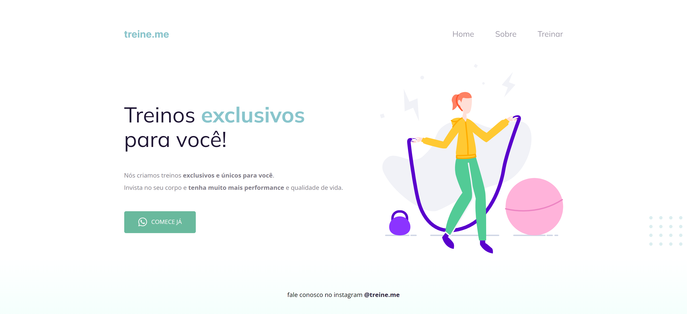

<h1 align="center">WEBSITE TREINE.ME</h1>

## 📋 Descrição do projeto

O <strong>website treine.me</strong> foi mais um dos projetos desenvolvidos durante a trilha explorer da <a href="https://www.rocketseat.com.br/">@Rocketseat</a>.

> HTML
- Tags semânticas;
- Tags de texto;
- Listas e botões;
- Inserção de imagens e links;
- Atributos de acessibilidade;
- Atributos de identificação.

> CSS
- Seletores e suas combinações;
- Propriedades de fontes;
- Propriedades de alinhamento e espaçamento;
- Propriedades de listas e textos;
- Box model;
- Unidades de medidas;
- Pseudo-classes;
- Breakpoints;

> Protótipo

🔗 [Clique aqui para acessar](https://nathxrz.github.io/TrilhaExplorer-projeto-2/)

## 🛠️ Tecnologias 
- HTML
- CSS

## 📩 Contato
> 📧 nathyrezendemachado@gmail.com  
> 💼 <a href="https://www.linkedin.com/in/nathalia-machado-021b1b230/"> LinkedIn</a>  