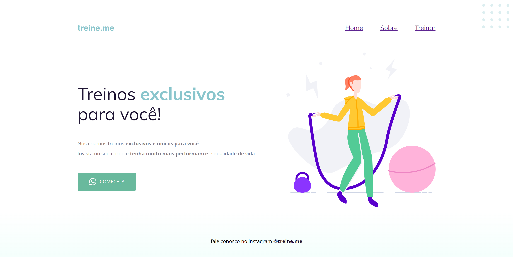

<h1 align="center">WEB SITE</h1>

## 📋 Descrição do projeto

O <strong>web site</strong> foi mais um dos projetos desenvolvidos durante a trilha explorer da <a href="https://www.rocketseat.com.br/">@Rocketseat</a>. No decorrer de sua construção, foi abordado o uso de seletores, pseudo-classes, a importância da utilização de tags semânticas, unidades de medidas, box model e tipos de alinhamentos/espaçamento.

>🔗 [clique aqui para visualizar](https://nathxrz.github.io/TrilhaExplorer-Projeto-02-stage-02/)

 

## 🛠️ Tecnologias
- HTML
- CSS

 

## 📩 Contato
> 📧 nathyrezendemachado@gmail.com  
> 💼 <a href="https://www.linkedin.com/in/nathalia-machado-021b1b230/"> LinkedIn</a>  

    